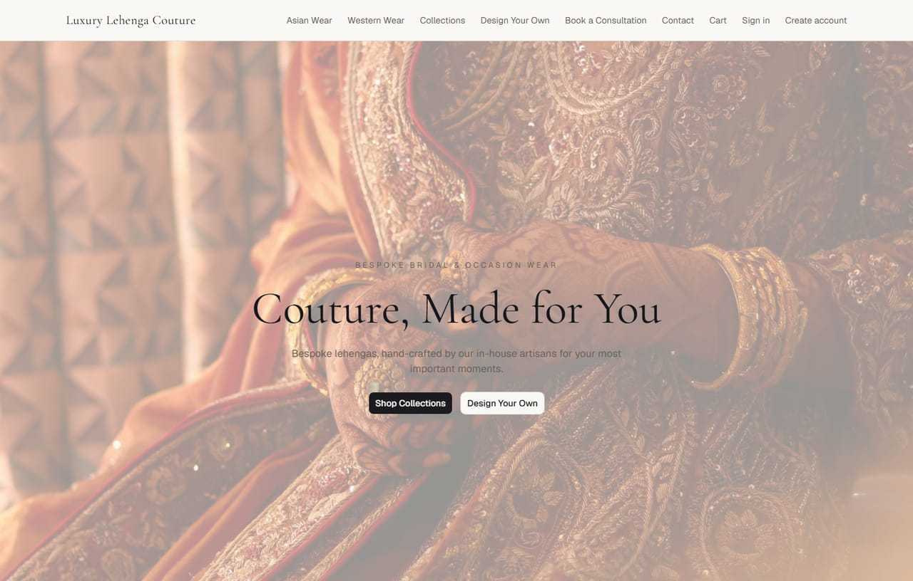
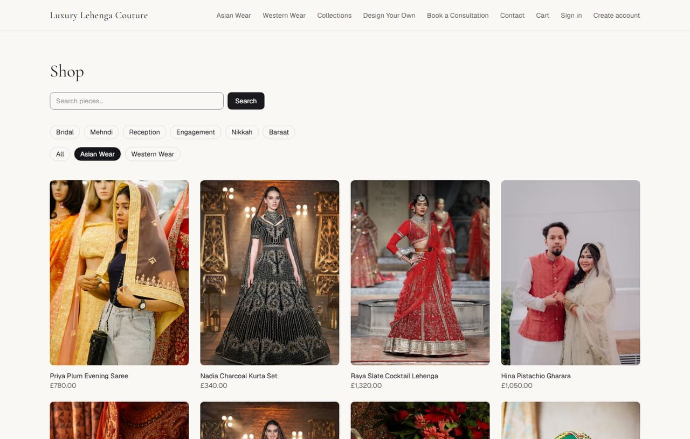
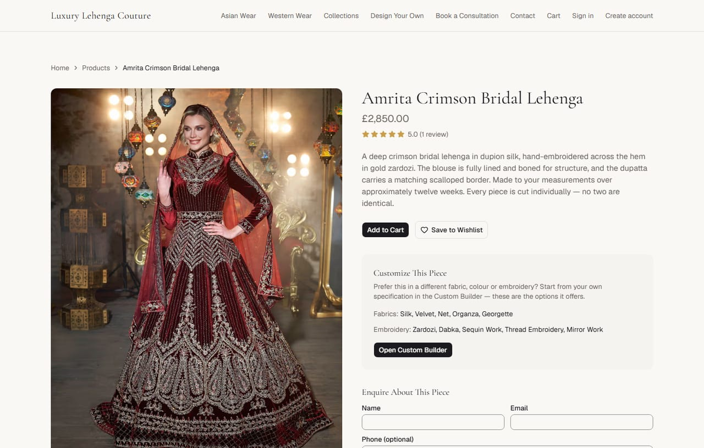
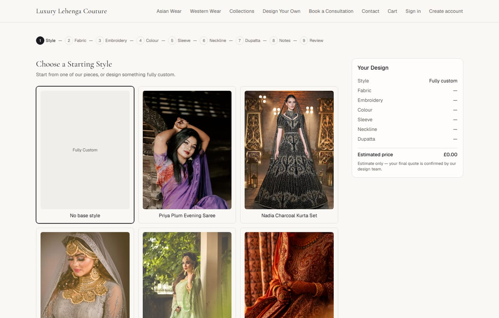
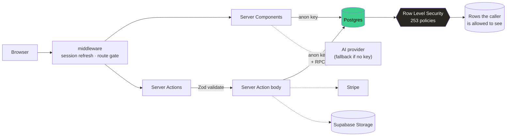
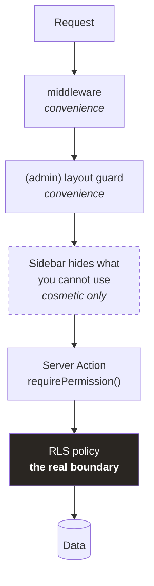
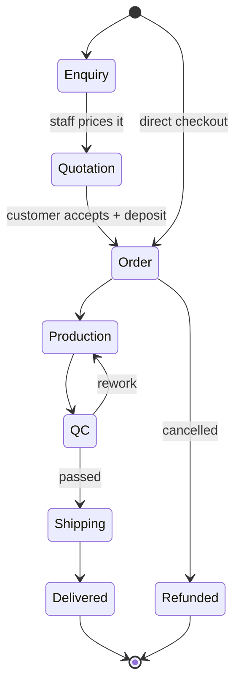
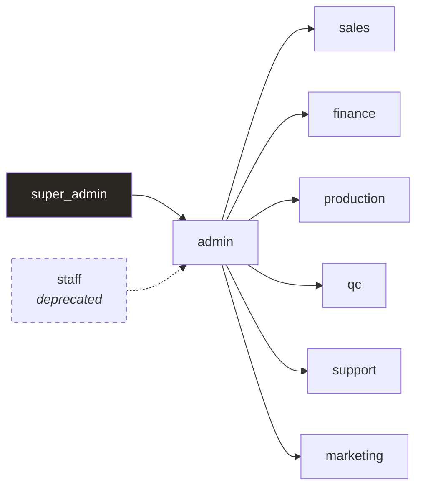

<div align="center">

# Luxury Lehenga Couture

**A made-to-measure bridal and occasion-wear storefront for the UK market, with a full back office behind it.**

Customers browse a catalogue, design a piece from scratch in a nine-step builder, book a consultation,
request a quotation, and follow the order through production to delivery. Staff run the whole business —
catalogue, orders, payments, production, shipping, marketing and content — from one admin panel with
per-role permissions.


</div>

---



---

## Contents

- [What it does](#what-it-does)
- [Screenshots](#screenshots)
- [Architecture](#architecture)
- [Getting started](#getting-started)
- [The five decisions that shape this codebase](#the-five-decisions-that-shape-this-codebase)
- [Testing](#testing)
- [Repository layout](#repository-layout)
- [Documentation](#documentation)
- [Contributing](#contributing)

---

## What it does

### Storefront

Home, catalogue with **category and occasion filters that compose**, product pages, collections, a
nine-step custom builder, cart, Stripe checkout, consultations, enquiries, blog, FAQ, and a customer
account area with orders, measurements, wishlist and a notification centre.

The catalogue is organised on two independent axes, which is a deliberate modelling choice rather
than a UI one:

| Axis | Answers | Values |
|---|---|---|
| **Category** | *Where does this piece live?* | Asian Wear · Western Wear |
| **Occasion** | *What is it for?* | Bridal · Mehndi · Nikkah · Baraat · Engagement · Reception |

`products.category_id` is a single foreign key; occasions are many-to-many. Making Nikkah and Mehndi
into categories would have forced every piece into exactly one event forever — and a lehenga can
genuinely suit both a mehndi and an engagement.

### Custom builder

Nine steps: Style → Fabric → Embroidery → Colour → Sleeve → Neckline → Dupatta → Notes → Review.
The price recalculates in Postgres on every step, guests can save and return by tokenised link
without an account, and a finished design becomes a quotation request.

### Admin

58 screens covering products, collections, categories, media, orders, quotations, payments and
refunds, production and QC workflow, shipping, enquiries, appointments, customers, reviews,
campaigns, banners, segments, content pages, SEO, analytics, settings, and a team screen for roles
and permissions.

### AI assistant

A customer-facing chatbot that answers from curated FAQs and recommends real catalogue pieces. It
runs behind a provider interface with **structural guardrails**: it cannot invent a price, promise a
delivery date, or claim anything about order or payment state. With no API key configured it falls
back to a deterministic provider rather than failing.

---

## Screenshots

|  |  |
|---|---|
| <br>**Catalogue** — category and occasion filters that compose | <br>**Product page** — gallery, sizing, made-to-measure enquiry |
| <br>**Custom builder** — nine steps, live estimate, saveable by link | <br>**Builder options** — photographs for fabric and embroidery, drawn diagrams for shape |

That last tile is worth a sentence, because it is a decision rather than an accident. Fabric and
embroidery are photographed: the texture *is* the thing being chosen, and stock libraries shoot it
well. Necklines, sleeves and dupatta styles are drawn: a sweetheart and a V-neck differ by one
curve, and searching either term returns the other about as often as not. A drawing is correct by
construction, so there is no matching step left to get wrong.

---

## Architecture

### Request path



The important line is the one from the browser to Postgres: **every request runs as the user**, with
the anon key, and RLS decides what comes back. The service-role key — which bypasses RLS entirely —
never appears in anything that reaches the client. It exists only in scripts and server-only code.

### Where authorisation actually lives



Four of those five layers are convenience. Only the last one stops anything. Hidden UI and route
guards make the product coherent; they are never the thing standing between a request and the data.
`scripts/verify-rls.mjs` and `scripts/verify-cross-user.mjs` prove it by signing in as real users and
trying to read each other's orders.

### Order lifecycle



Each transition is a Server Action guarded by a permission and an RLS policy, and each writes a
notification the customer sees in their account and (unless opted out) by email.

### Roles

Nine roles, each with a permission set stored in the database and editable from the admin:



Only `super_admin` can change anyone's role — deliberately narrower than before Module 26, and
enforced by a `SECURITY INVOKER` trigger rather than application code.

---

## Getting started

```bash
npm install
cp .env.example .env.local        # fill in your Supabase project URL and keys
npm run db:migrate                # applies all 62 migrations in order
npm run dev
```

Open <http://localhost:3000>.

### Populate a browsable shop

```bash
node --env-file=.env.local scripts/seed-demo.mjs --seed
node --env-file=.env.local scripts/seed-collection.mjs nikkah --seed
node --env-file=.env.local scripts/seed-builder-images.mjs --seed
node --env-file=.env.local scripts/seed-homepage-media.mjs --seed
```

Everything the demo seeder creates is recorded in a `demo_seed_items` manifest, so
`seed-demo.mjs --clear` removes exactly those rows and **provably cannot touch real business data** —
a real product has no manifest entry and is therefore never a candidate.
See [`docs/DEMO-STORE.md`](./docs/DEMO-STORE.md).

### Environment variables

See `.env.example`. `NEXT_PUBLIC_*` values are safe in the browser. `SUPABASE_SERVICE_ROLE_KEY`
bypasses RLS entirely — never import it into anything that reaches the client.

The app runs with **no** Stripe, Anthropic, courier or Instagram credentials. Each of those sits
behind a provider interface with a working free-tier or mock implementation.

---

## The five decisions that shape this codebase

**1. Security lives in the database.** Covered above. It is the single assumption most of the rest
follows from.

**2. Two permission mechanisms, side by side, on purpose.** Module 26 added a
`permissions`/`role_permissions` table and a `has_permission()` function, then layered 82 new
policies alongside the existing `is_admin()` ones. Postgres PERMISSIVE policies are OR'd, so an
addition can only *widen* access — which made the change mathematically incapable of narrowing an
existing admin's reach. Consolidating the 179 `is_admin()` references into one mechanism would have
meant touching all of them; that risk was not worth taking, so both remain.
See [`docs/PERMISSIONS.md`](./docs/PERMISSIONS.md).

**3. Provider interfaces for anything external.** Shipping, email, social and AI each sit behind a
small interface. That is why the app runs with no third-party accounts at all, and why swapping in a
real courier later means implementing one interface rather than editing call sites.

**4. No animation library.** Framer Motion was removed in Module 28 — 5.4 MB for effects that CSS
keyframes and one rAF-throttled passive scroll listener now do. The hero's `<h1>` animates transform
only, never opacity, because an element at `opacity: 0` has not painted and was pushing Largest
Contentful Paint out by the length of the animation on the site's most important route.

**5. Images are always re-hosted on Supabase Storage.** Module 28's `remotePatterns` and Module 29's
CSP each allow the Supabase host only, so an external image URL breaks the page twice over. Branding
and builder assets carry a **content hash in the filename** — a fixed name with a `?v=` query string
does not reliably beat every cache, and a picture that will not change is a genuinely confusing bug
to chase.

Full reasoning in [`docs/ARCHITECTURE.md`](./docs/ARCHITECTURE.md).

---

## Testing

There is no Vitest, no Jest and no Playwright. Tests are Node's built-in `node:test` plus 41
standalone scripts that drive the real database and a real server.

```bash
npm run build && npm start                              # most scripts need a running server
node --env-file=.env.local scripts/test-orders.mjs      # one area
node --env-file=.env.local scripts/run-suite.mjs        # everything, with per-script counts
```

`run-suite.mjs` records exact PASS/FAIL counts per script and can diff two runs. The bar for a risky
change is not "the tests still pass" — it is **the same numbers**. A script that quietly drops from
44 checks to 40 because a setup step broke would otherwise read as a pass.

### Three habits, each learned from a real failure

- **Test the boundary the UI actually calls.** The custom builder was broken from Module 6 onward
  while `test-builder-rpcs.mjs` passed the entire time — it called the Postgres functions directly,
  and the bug was in the Zod schema that every real request crosses first. Testing the layer beneath
  a bug proves nothing about the feature.

- **Clean up at the START of a run, not the end.** A crashed process never reaches its teardown.
  Scripts sweep their own leftovers before creating new fixtures, because leaked test products once
  appeared on the live storefront as category filter chips.

- **Never pipe `npm run build` through `head`.** The SIGPIPE kills the build partway and leaves a
  `.next` directory that returns 500 on every route. Redirect to a log file instead.

See [`docs/TESTING.md`](./docs/TESTING.md).

---

## Repository layout

```text
src/
  app/
    (storefront)/    public site — home, catalogue, builder, cart, checkout, blog
    (auth)/          sign in, register, password reset, callback
    (account)/       customer dashboard — orders, measurements, wishlist, notifications
    (admin)/         59 admin screens, including the AI assistant
    api/             chat, MCP, the admin assistant, webhooks, cron
  components/
    ui/              shadcn primitives on Base UI
    builder/         the nine-step custom builder
    storefront/      home page sections, product and collection pieces
    admin/           admin shell, sidebar, tables
  features/          Server Actions, grouped by domain
  lib/
    supabase/        browser, server and middleware clients
    auth/            session, roles, permissions
    ai/              provider interface, guardrails, query intent
    mcp/             MCP server, tool registry, authorization, audit, admin chat loop
    validations/     Zod schemas for every Server Action
docs/                fourteen documents, one per subsystem
scripts/             migration runner, 48 test scripts, seeders, verifiers
supabase/migrations/ 62 SQL migrations, applied in filename order
```

---

## Documentation

| Document | Covers |
|---|---|
| [ARCHITECTURE.md](./docs/ARCHITECTURE.md) | Structural decisions and the reasoning behind them |
| [PERMISSIONS.md](./docs/PERMISSIONS.md) | The nine roles, the permission matrix, RLS strategy |
| [SECURITY.md](./docs/SECURITY.md) | Module 29 audit — findings, fixes, headers, CSP |
| [TESTING.md](./docs/TESTING.md) | How the suite is organised and what each script proves |
| [PERFORMANCE-A11Y.md](./docs/PERFORMANCE-A11Y.md) | Bundle budget, contrast, keyboard and screen-reader work |
| [SEO.md](./docs/SEO.md) | Metadata, structured data, sitemaps |
| [ANALYTICS.md](./docs/ANALYTICS.md) | Event tracking and cookie consent |
| [EMAIL.md](./docs/EMAIL.md) | Provider, templates, delivery, opt-out |
| [NOTIFICATIONS.md](./docs/NOTIFICATIONS.md) | In-app centre, categories, email preferences |
| [SETTINGS.md](./docs/SETTINGS.md) | The settings registry and how to add a key |
| [AI.md](./docs/AI.md) | Guardrails, providers, occasions, recommendations |
| [MCP.md](./docs/MCP.md) | The AI control layer — tools, authorization, confirmation, audit |
| [MCP-DECISIONS.md](./docs/MCP-DECISIONS.md) | Why the MCP layer is shaped the way it is |
| [DEMO-STORE.md](./docs/DEMO-STORE.md) | Seeding, the manifest, and why `--clear` is safe |

---

## Contributing

Each module is scoped, implemented and verified independently — section 13 of
[the Master Build Plan](./Luxury-Lehenga-Master-Build-Plan.md) has the exact workflow. In short:
inspect, agree a plan **before** writing code, implement, verify against a production build, update
the plan's status, commit.

Conventions this repository holds to:

- **One branch per feature.** Work does not go straight to `main`.
- **Commits explain the why.** The diff already shows what changed; the message is for the reader who
  needs to know what was tried, what was rejected, and what is still known to be wrong.
- **Known limitations get written down** — in the code and in the commit — rather than left for
  someone to rediscover.

### Known limitations

- The storefront listing has **no pagination and no user-controlled sort**. Every published product
  renders on one page, newest first. Fine for a boutique catalogue; worth revisiting before it grows.
- `staff` remains a valid role for backwards compatibility, mapped to the narrowest permission set.
  Retiring it is a data migration.
- Permissions are coarse-grained per domain (`orders.write`), not per-field or per-record. Row-level
  scoping such as "sales sees only their own accounts" is not modelled.
- One demo product (`isla-champagne-two-piece`) ships as a **draft** for want of a photograph that
  matches what it actually is.
